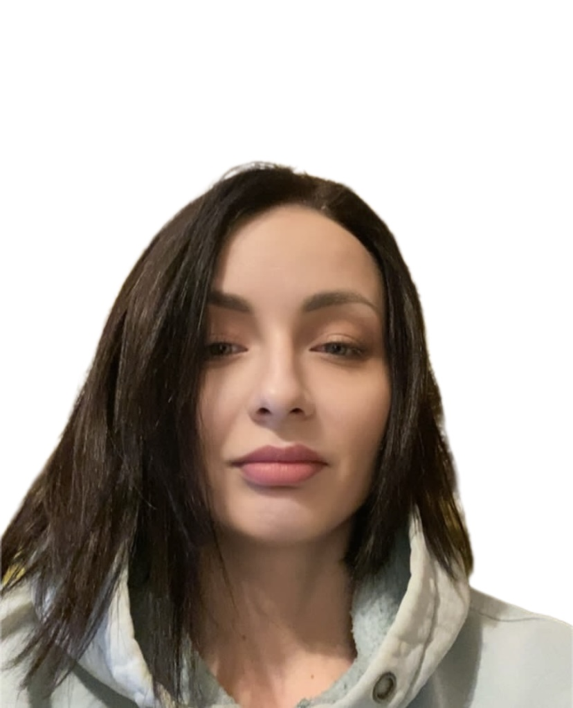

# Anna Shchebunyaeva



---

### Junior Frontend Developer

---

### Contact Information

- Phone: +7 (964) 446-8059
- Email: [smartupfit@yandex.ru](mailto:smartupfit@yandex.ru)

---

### About Me

Owner of a CrossFit gym and personal trainer from 2013 to 2024. At the beginning of 2024, I decided to reduce my work with clients and pursue a career that involves more intellectual tasks. I've long dreamed of becoming a programmer.

I believe my skills in organizing gym operations, my sense of responsibility, and my ability to think creatively will benefit me in this new field. I possess strong communication skills, an analytical mindset, and an ability to focus on tasks for extended periods. Spending significant time solving a single problem is something I find engaging.

---

### Skills

- Languages: HTML, CSS, Java, Python
- Version Control: Git
- Development Tools: VS Code, IntelliJ IDEA, PyCharm

---

### Code Example

```java
public class Calculator {

    public static <T extends Number, U extends Number> double sum(T t, U u) {
        return t.doubleValue() + u.doubleValue();
    }

    public static <T extends Number, U extends Number> double multiply(T t, U u) {
        return t.doubleValue() * u.doubleValue();
    }

    public static <T extends Number, U extends Number> double divide(T t, U u) {
        if (u.doubleValue() == 0) {
            throw new ArithmeticException("Cannot divide by zero");
        }
        return t.doubleValue() / u.doubleValue();
    }

    public static <T extends Number, U extends Number> double subtract(T t, U u) {
        return t.doubleValue() - u.doubleValue();
    }
}

public class Main {
    public static void main(String[] args) {
        double res_sum = Calculator.sum(3, 5.4);
        double res_mult = Calculator.multiply(3, 5.4);
        double res_div = Calculator.divide(3, 5.4);
        double res_substr = Calculator.subtract(3, 5.4);
        System.out.println("Addition: " + res_sum);
        System.out.println("Multiplication: " + res_mult);
        System.out.println("Division: " + res_div);
        System.out.println("Subtraction: " + res_substr);
    }
}
```
---

### Work Experience

- 2012-2013: Clinical Psychologist at the *Institute of Clinical Psychology and Psychiatry*
- 2013-2024: Owner and Trainer at *SmartUp CrossFit Gym*

---

### Education

- University: Vladivostok State Medical University  
- Specialization: Clinical Psychology

---

### Languages

- Russian: Native
- English: Intermediate (B1)